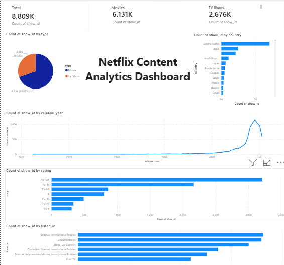

# 🎬 Netflix Content Analytics Dashboard

## 📌 Project Overview

Netflix hosts thousands of movies and TV shows across different countries, genres, and audience categories. This project analyzes Netflix's content library using Excel and Power BI to uncover content distribution patterns, audience preferences, geographic trends, and release trends over time.

The project demonstrates the complete data analytics workflow including data exploration, data cleaning, pivot table analysis, dashboard development, and insight generation.

---

## 🎯 Objectives

* Analyze the distribution of Movies and TV Shows.
* Identify the countries contributing the most content.
* Study Netflix's content growth over time.
* Analyze audience targeting through content ratings.
* Discover the most popular content genres.
* Build an interactive dashboard for business decision-making.

---

## 🛠️ Tools & Technologies

* Microsoft Excel

  * Data Exploration
  * Pivot Tables
  * Data Analysis

* Microsoft Power BI

  * Dashboard Development
  * KPI Visualization
  * Interactive Charts

* GitHub

  * Project Documentation
  * Version Control

---

## 📊 Dataset Information

**Dataset:** Netflix Titles Dataset

**Total Records Analyzed:** 8,807+

**Key Attributes:**

* Content Type
* Title
* Country
* Release Year
* Rating
* Genre
* Duration

---

## 📈 Key Business Insights

### 1. Content Distribution

* Movies: 6,131
* TV Shows: 2,676

**Insight:** Movies account for nearly 70% of Netflix's content library, indicating a strong focus on film-based content.

---

### 2. Top Content-Producing Countries

| Country        | Titles |
| -------------- | -----: |
| United States  |  2,818 |
| India          |    972 |
| United Kingdom |    419 |
| Japan          |    245 |
| South Korea    |    199 |

**Insight:** The United States dominates Netflix's content catalog, while India emerges as the second-largest contributor.

---

### 3. Content Growth Trend

**Key Findings:**

* Significant growth observed between 2015 and 2018.
* Peak content production occurred in 2018.
* Netflix experienced rapid expansion during the mid-to-late 2010s.

---

### 4. Audience Ratings Analysis

Most Common Ratings:

* TV-MA
* TV-14
* TV-PG

**Insight:** Netflix primarily targets mature and teenage audiences, with adult-oriented content forming a major portion of the catalog.

---

### 5. Genre Analysis

Most Popular Genres:

* Dramas & International Movies
* Documentaries
* Stand-Up Comedy

**Insight:** International content and drama-based entertainment play a significant role in Netflix's global strategy.

---

## 📊 Dashboard Components

### KPI Cards

* Total Titles
* Movies
* TV Shows

### Visualizations

* Movies vs TV Shows Distribution
* Top Countries by Content Count
* Content Release Trend
* Content Ratings Analysis
* Top Genres Analysis

---

## 📷 Dashboard Preview



---

## 📂 Project Structure

```text
Netflix-Content-Analytics
│
├── dataset
│   └── netflix_titles.csv
│
├── dashboard
│   └── Netflix_Content_Analytics.pbix
│
├── screenshots
│   ├── final_dashboard.png
│   ├── 01_movies_vs_tvshows.png
│   ├── 02_top_countries.png
│   ├── 03_release_year_trend.png
│   ├── 04_content_ratings.png
│   └── 05_top_genres.png
│
└── docs
    ├── Netflix_Analysis.xlsx
    └── insights.txt
```

---

## 🚀 Skills Demonstrated

* Data Cleaning
* Data Analysis
* Exploratory Data Analysis (EDA)
* Business Intelligence
* Data Visualization
* Dashboard Design
* Excel Pivot Tables
* Power BI Reporting
* Insight Generation

---

## 📌 Conclusion

This project demonstrates how raw entertainment data can be transformed into meaningful business insights through data analytics and visualization. The dashboard provides a clear overview of Netflix's content distribution, growth patterns, audience targeting strategy, and genre preferences, enabling data-driven decision-making.
